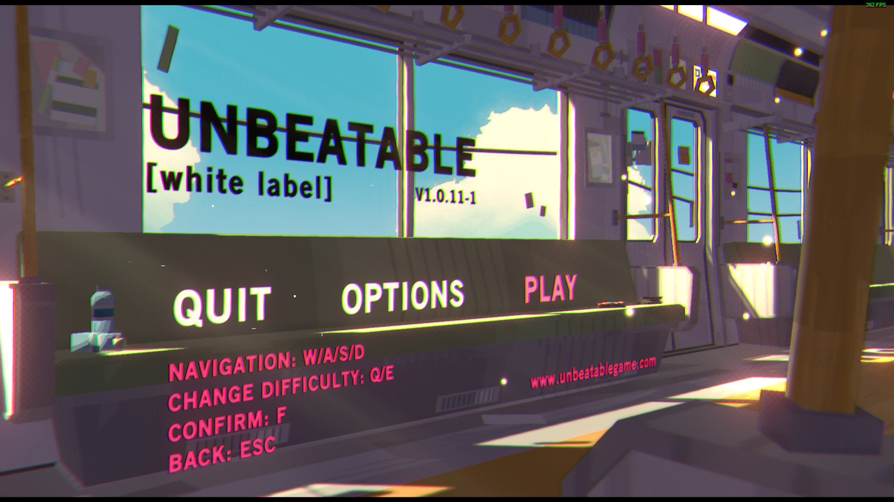
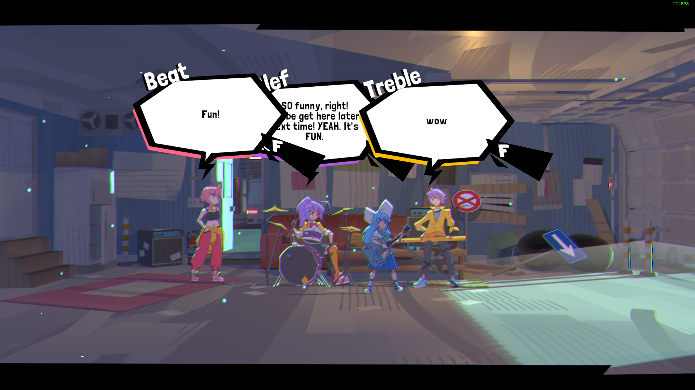
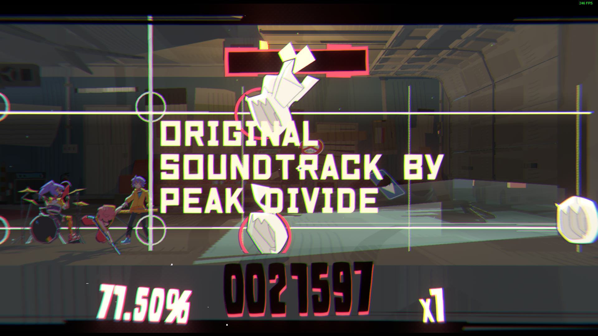
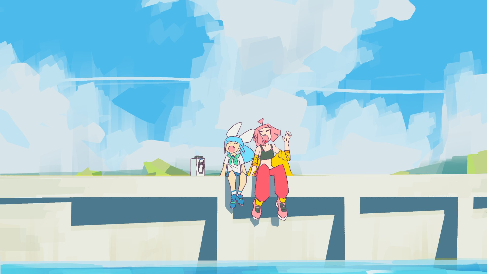

thisisawordtoreplace thisisawordtoreplace thisisawordtoreplace

On 2023-11-16 I was browsing the "Anime" tag on Steam and stumbled upon the game demo "Unbeatable \[White Label]". It's just a demo, though it does have it's own listing on Steam. The full game doesn't even have it's own listing yet. This demo came out two years ago and there is no ETA on the full game. I came across reviews and some of the reviewers had tens of hours logged into the game. I thought "I can't imagine ever spending that much time on a demo, no matter how good it is". Then, within perhaps mere minutes of opening the game, I understood.

<iframe style="border: 0; width: 100%; height: 42px;" src="https://bandcamp.com/EmbeddedPlayer/album=1968853333/size=small/bgcol=333333/linkcol=fe7eaf/track=3557535542/transparent=true/" seamless></iframe>
I recently (from today) watched a video that mentioned the concept of a piece of media hitting your heart before your mind. Unbeatable hit my heart, and it hit hard. It felt like when I first discovered my love for FLCL and The World Ends With You (TWEWY), my two favorite pieces of media ever. Any direct comparisons of Unbeatable to other media, as many Steam reviews bring up, is a disservice to how special Unbeatable is. The visuals are a beautifully, meticulously crafted yet rough aesthetic reminsict of a nostalgic youthful sunny 90s summer. The world is within the character's grasp, yet so hard to grab. There's the feeling of freedom, but the fear and the anxiety that goes with such as well. The "game" part of it is ala Muse Dash but with much more curated visual flavor. The perspective frequently changes, notes coming from both the left and the right to make sure your eyes don't get complacent. After you complete the tutorial, you get a small peek at the "overworld" gameplay.

You walk into a building and there are your bandmates, waiting for your late-ass. They're rowdy. They're talking over each other. They show their distinct personalities within their first line of dialogue. The text in their speech bubbles match their personality and their tone with too many capitals to all lowercase to oversized text. They talk like a bunch of modern weird found-family kids. It feels intimate. There's slices of story before and after playing each original song for the first time. It feeds into each of those songs just right, giving your the information to enhance your interpretation of the lyrics. The original songs are so, so unbelievably awesome. Most rhythm games tend to just use electronic music, generic otaku music, collab music, etc. but Unbeatable's music is rock done by their very own band: Peak Divide.

"[Empty Diary](https://youtu.be/oCv6mGvQQUs?si=JqjzC6Zkr7zEfFkE)" and "[Mirror](https://youtu.be/GaqDu16Rfe4?si=yM53MvTCLhSd5y34)" are my personal standouts. Playing these songs don't feel like how they do in your typical rhythm game where you're simply trying to get a high score or idly play to have something to do. It's a cathartic experience. It forces your soul to synchronize itself with the music and the feeling behind it. It's similar to the sink or swim beginning that many cult classics have. My soul resonated back to the game, allowing our feelings to become one in the same. It's a perfectly cultivated balance that can only be cultivated by pure feeling. Don't think too much, pick up the instrument, and start playing your fucking heart out.

My imagination can't stop running wild with just how good the emotional highs of the story can be with every single aspect of this game playing off each other. Rhythm games rarely have stories let alone the story being as important as the rhythming. Unbeatable is a low-profile project and I expect it to always be the way to that degree. It makes the experience feel deeply personal, moreso than otherwise. The creators are simply available to talk to on their Discord. These are people who could just be another friend of one's. Just, people, creating something so special. I think that speaks to what Unbeatable will manage to do in it's final form. I'll patiently await that form, for the song that Unbeatable sings, so that I can give it a meaning for myself.

>Oh, I reach out / To find a song / To give it a meaning for myself / And I'll take hold / And I'll cling tight / But it always slips away

